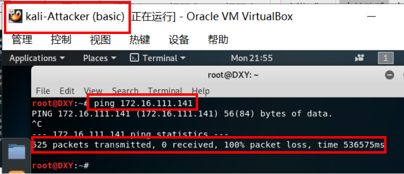

# chap0x01 实验报告---基于 VirtualBox 的网络攻防基础环境搭建

## 实验要求
* 虚拟机安装并设置节点：
    * 虚拟机：VirtualBox 虚拟机
    * 节点：(ps:括号里为我设置的相应虚拟机节点名称)
       * 攻击者主机(Kali-Attacker)
       * 网关(debian-Gateway)
       * 靶机(xp-victim-1/xp-victim-2/kali-victim-1/sqli-victim-2)
    * 要求：
       * 将各个节点的虚拟网络类型按需配置
       * 所有节点制作成基础镜像（多重加载的虚拟硬盘）

* 网络连通性测试：
    * 靶机可以直接访问攻击者主机
    * 攻击者主机无法直接访问靶机
    * 网关可以直接访问攻击者主机和靶机
    * 靶机的所有对外上下行流量必须经过网关
    * 所有节点均可以访问互联网  

## 实验过程
### 所有节点

### 网络拓扑图

### 节点网络配置以及虚拟硬盘的多重加载
    网络配置设置：设置-->网络-->网卡1/2/3/4  
    多重加载: 管理-->虚拟介质管理-->释放虚拟硬盘-->修改属性类型从“普通”变为“多重加载”-->挂上设置后的多重加载的虚拟硬盘

             
* 攻击者主机(Kali-Attacker)  
三块网卡 （其实一块NAT模式的就够了）
    * NAT网络：10.0.2.6/24
    * Host-Only网络1：192.168.56.103/24
    * Host-Only网络2：192.168.62.3/24   

* 网关(debian-Gateway)  
四块网卡
    * NAT网络：10.0.2.15/24
    * Host-Only网络1：192.168.56.113/24
    * 内部网络intnet1：172.16.111.1/24
    * 内部网络intnet2：172.16.222.1/24

* 靶机(以xp-victim-1和Kali-victim-1为例)  
    * xp-victim-1:  一块网卡 
        * 内部网络intnet1：172.16.111.141/24   （默认网关：172.16.111.1）  
    
    * Kali-victim-1:  一块网卡
        * 内部网络intnet1：172.16.111.142/24   
    

### 网络连通性测试：  
* 靶机可以直接访问攻击者主机  
   攻击者主机：10.0.2.6   
   靶机能ping通攻击者主机，说明在网络层靶机可以直接访问攻击者主机
     
   (ps:网关配置端口转发后才能ping通，若网关未配置端口转发，则ping不通，本实验中老师给的网关已经配置好了)

* 攻击者主机无法直接访问靶机  
   靶机(以xp-victim-1为例)：172.16.111.141/24  
   攻击者主机无法ping通靶机，说明在网络层靶机无法直接访问攻击者主机
     

* 网关可以直接访问攻击者主机和靶机
    * 攻击者主机：10.0.2.6  
      网关能ping通攻击者主机，说明在网络层网关可以直接访问攻击者主机  (NAT网络模式下虚拟机间可以通信)
    
     
    * 靶机(sqli-victim-1)：172.16.111.142/24  
      网关能ping通此靶机，说明在网络层网关可以直接访问此靶机 (同一内部网络下虚拟机间可以通信)
        
    * 靶机(xp-victim-1)：172.16.111.141/24  
      网关不能ping通此靶机，说明在网络层网关无法直接访问此靶机  
      
      发现这里ping不通的原因是此靶机开启了windows防火墙  
      
      关闭后再次尝试，ping成功了，说明在关闭防火墙的情况下，在网络层网关可以直接访问此靶机  
      
  
* 靶机的所有对外上下行流量必须经过网关  
   * 开启网关虚拟机针对内网模式intnet1的网卡(enp0s9)的抓包
   * 在靶机处ping百度观察到网关抓到了包 
      
   * 开启网关虚拟机针对NAT网络模式的网卡(enp0s3)的抓包也同理
    
   * 其他情况同理，靶机的所有对外上下行流量必须经过网关
* 所有节点均可以访问互联网  
    * 攻击者主机可以ping通百度，可以访问互联网
    
    * 网关可以ping通百度，可以访问互联网
    
    * 靶机可以ping通百度，可以访问互联网
    

## 实验总结理解
### 理解虚拟机中的网络连接方式

* NAT：网络地址转换（Network Address Translation），这是最简单的虚拟机上网方式。虚拟机所有的网络访问都通过主机来实现(用主机物理网卡)，虚拟机本身不能被主机及其它互联网上的机器访问。虚拟机之间也不能相互访问。
  
* Bridged Adapter：桥接网卡模式。它使得虚拟机能被分配到一个网络中独立的IP，所有网络功能完全和在网络中的真实机器一样。缺点：占用网段中的IP地址。
  
* Internal Network：内部网络模式。虚拟机与主机所在的网络隔离开来，只有虚拟机之间可以通信，而无法跟主机，或者主机所在的网络通信，所以也就无法上互联网。
* Host-Only Adapter：主机中的网络适配器模式。可以理解为VBox在主机中虚拟出一块网卡,所有虚拟机都连接到这块网卡。我们可以通过设置这张网卡来实现上网及其他很多功能。若不配置，默认宿主机不为虚拟机提供任何路由服务，因此虚拟机只能和宿主机进行通信，而不能连接到实际网络上。

