# 基于 Scapy 编写端口扫描器
## 实验目的
* 掌握网络扫描之端口状态探测的基本原理

## 实验环境
* python + scapy

## 实验要求
* 禁止探测互联网上的 IP ，严格遵守网络安全相关法律法规
* 完成以下扫描技术的编程实现
   * TCP connect scan / TCP stealth scan
   * TCP Xmas scan / TCP fin scan / TCP null scan
   * UDP scan
* 上述每种扫描技术的实现测试均需要测试端口状态为：开放、关闭 和 过滤 状态时的程序执行结果
* 提供每一次扫描测试的抓包结果并分析与课本中的扫描方法原理是否相符？如果不同，试分析原因；
* 在实验报告中详细说明实验网络环境拓扑、被测试 IP 的端口状态是如何模拟的
* （可选）复刻 nmap 的上述扫描技术实现的命令行参数开关

## 基础知识：总结扫描原理 & 端口设置
* TCP Connect Scan：
  * 这种方法最简单，直接连到目标端口并完成一个完整的三次握手过程（SYN, SYN/ACK, 和ACK）。（注意：该连接由客户端在最终握手中发送确认ACK+RST标志来建立）
  * 如果完成了三次握手，则服务器上的端口打开。
  * 如果服务器响应TCP数据包内设置RST标志，则服务器上的端口关闭。
  * 如果服务器无TCP包响应，则端口被过滤。  
    如果服务器使用ICMP数据包type3和ICMP的code1,2,3,9,10或13进行响应，则端口被过滤.
  * 缺点是容易被目标系统检测到。
* TCP Stealth Scan：
  * 类似于TCP连接扫描。但是最后在TCP数据包中发送的是RST标志而不是RST + ACK。
  * 此技术用于避免防火墙检测端口扫描。
* TCP XMAS Scan：
  * 在XMAS扫描中，客户端将设置了PSH，FIN和URG标志的TCP数据包和要连接的端口发送到服务器。
  * 如果服务器响应TCP数据包内设置的RST标志，则服务器上的端口关闭。
  * 如果服务器无TCP包响应，无法区分服务器上的端口打开/被过滤。
  * 如果服务器使用ICMP数据包type3和ICMP的code1,2,3,9,10或13进行响应，则端口被过滤.
* TCP FIN scan： 
  * 这种方法向目标端口发送一个FIN分组。
  * 如果服务器响应TCP数据包内设置的RST标志，则服务器上的端口关闭。
  * 如果服务器无TCP包响应，无法区分服务器上改端口是打开/被过滤。
  * 如果服务器使用ICMP数据包type3和ICMP的code1,2,3,9,10或13进行响应，则端口被过滤.
* TCP NULL scan：
  * 发送一个没有任何标志位的TCP包给服务器。
  * 如果服务器响应TCP数据包内设置的RST标志，则服务器上的端口关闭。
  * 如果服务器无TCP包响应，无法区分服务器上改端口是打开/被过滤。
  * 如果服务器使用ICMP数据包type3和ICMP的code1,2,3,9,10或13进行响应，则端口被过滤.
* UDP Scan：
  * 客户端发送一个UDP数据包，其中包含要连接的端口号。
  * 如果服务器使用UDP数据包响应客户端，则该特定端口在服务器上处于打开状态。
  * 如果服务器无UDP包响应，无法区分服务器上改端口是打开/被过滤。
  * 服务器响应ICMP端口不可达错误type3和code3，则端口在服务器上关闭。
  * 如果服务器使用ICMP的type3和code1,2,9,10或13响应客户端，则服务器上的该端口被过滤。
* 端口设置
  * 查看靶机端口状态：netstat -anp
  * 开启80端口： nc -lp 80 （开启udp监听时要加上-u）
  * 关闭80端口： kill 端口对应的进程ID 
  * 设置防火墙过滤80端口：
    * iptables -L -n 查看本机的iptables设置情况
    * iptables -A INPUT -p tcp -m tcp --dport 80 -j REJECT 开启防火墙对指定端口的过滤（80端口）
    * 关闭防火墙（清空防火墙设置，关闭对80端口的过滤）   
        * iptables -F 清除预设表filter中的所有规则链的规则      
        * iptables -X 清除预设表filter中使用者自定链中的规则   

## 实验过程 
## （一）拓扑结构： 沿用的之前攻击者主机和靶机     
* 攻击者主机更换NatNetwork网卡 为 intnet1内部网络 的网卡    
  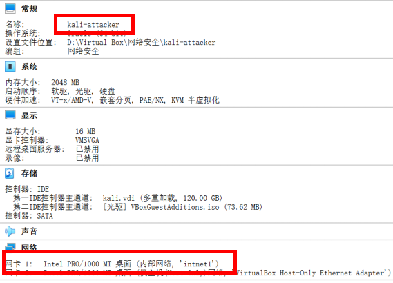    
* 靶机同样有 intnet1内部网络 的网卡   
      
* 拓扑结构图  
  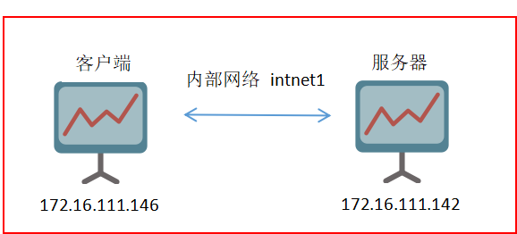   
* 网卡明细 
  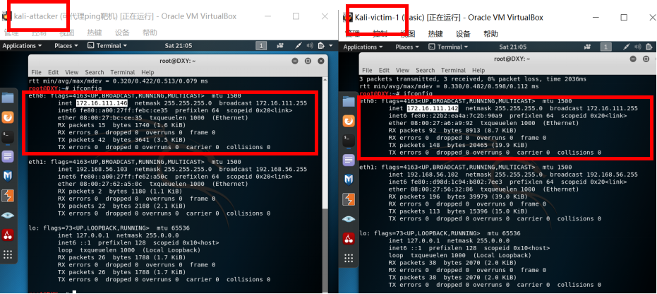   

## （二）扫描技术的编程实现  
  * 根据 [Port Scanning using Scapy](https://resources.infosecinstitute.com/port-scanning-using-scapy/) 以及其他网上资料 完成了各种扫描方式的编程实现
  * 详情见本作业文件的code文件夹
  * 遇到的问题：在py文件中导入scapy库的时候，用from scapy.all import *没用  
    修改为：
      * from scapy.layers.inet import IP,UDP, TCP, ICMP   
      * from scapy.all import sr,sr1
  * 利用ssh的scp口令将主机上的扫描代码传输到attacker虚拟机的code文件夹
    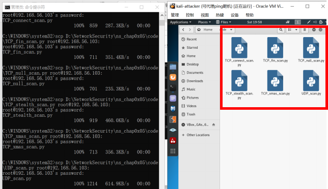  

## （三） 上述6种扫描技术的实现测试      
* TCP Connect Scan  
  * 端口关闭状态的测试
    * 查看靶机哪些端口被打开，发现此时victim靶机的80端口并没有打开监听    
      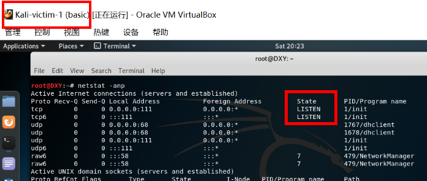      
    * 在victim靶机设置监听eth0网卡开始抓包  
      在Attacker攻击者虚拟机运行扫描文件TCP_connect_scan.py，停止抓包，存储在本地    
      在虚拟机Attacker界面观察到端口扫描的结果是：靶机victim的80端口为关闭状态    
          
    * 分析靶机抓到的包      
      * 攻击者主机给靶机的80端口发送了设置SYN标志的TCP包  
      * 靶机发送给攻击者主机的返回包中设置了RST标志
      * 证明了端口关闭，这与课本中的扫描方法原理相符，实验成功。
    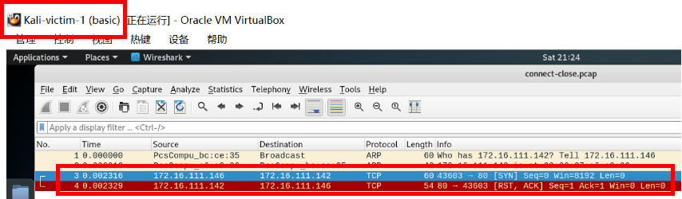    
      
  * 端口开启状态的测试
    * 打开靶机的80端口监听  
    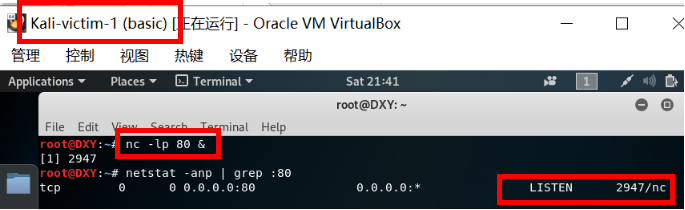
    * 在victim靶机设置监听eth0网卡开始抓包    
      在Attacker攻击者虚拟机运行扫描文件TCP_connect_scan.py，停止抓包，存储在本地    
      在虚拟机Attacker界面观察到端口扫描的结果是：靶机victim的80端口为打开状态    
      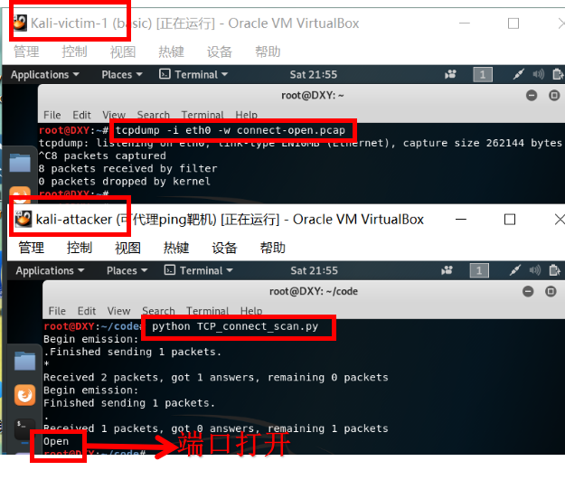    
    * 分析靶机抓到的包      
      * 攻击者和靶机之间进行了完整的3次握手TCP通信（SYN, SYN/ACK, 和RST）
      * 并且该连接由靶机在最终握手中发送确认ACK+RST标志来建立
      * 证明了端口打开，这与课本中的扫描方法原理相符，实验成功。
    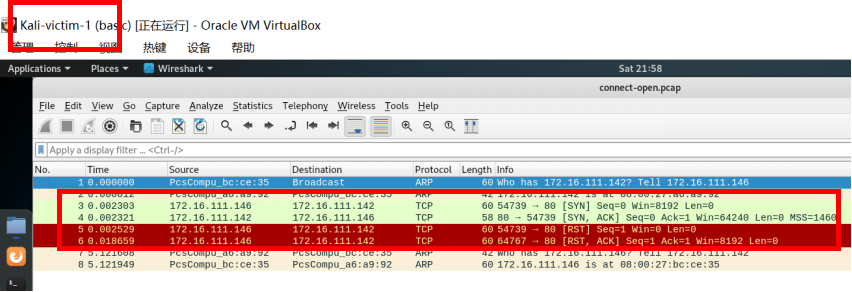    
    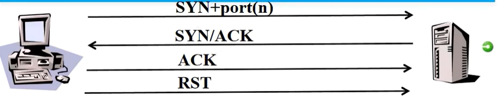 
  * 端口过滤状态的测试
    * 在victim靶机设置80端口被防火墙过滤，确保设置成功  
    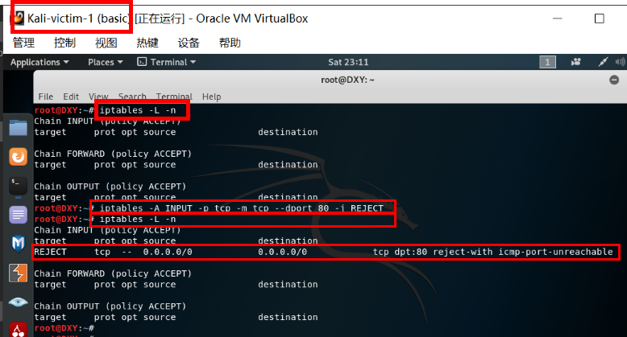
    * 在victim靶机设置监听eth0网卡开始抓包    
      在Attacker攻击者虚拟机运行扫描文件TCP_connect_scan.py，停止抓包，存储在本地
      在虚拟机Attacker界面观察到端口扫描的结果是：靶机victim的80端口为过滤状态    
    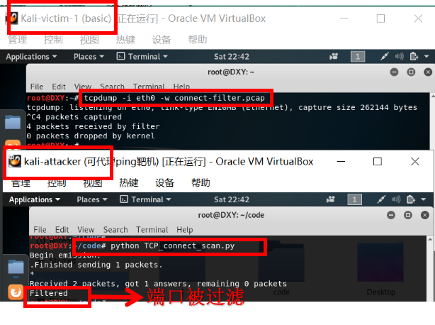    
    * 分析靶机抓到的包      
      * 攻击者主机给靶机的80端口发送了设置SYN标志的TCP包  
      * 靶机未返回TCP数据包给攻击者
      * 靶机返回给攻击者一个ICMP数据包，且该包类型为type3
      * 证明了端口被过滤，这与课本中的扫描方法原理相符，实验成功。
    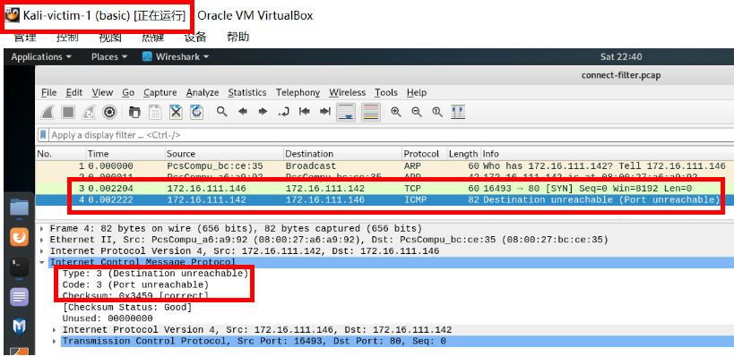    

* TCP Stealth Scan 
  * 端口关闭状态的测试
    * 关闭防火墙  
       
    * 查看靶机哪些端口被打开，发现此时victim靶机的80端口并没有打开监听    
            
    * 在victim靶机设置监听eth0网卡开始抓包  
      在Attacker攻击者虚拟机运行扫描文件TCP_stealth_scan.py，停止抓包，存储在本地    
      在虚拟机Attacker界面观察到端口扫描的结果是：靶机victim的80端口为关闭状态    
          
    * 分析靶机抓到的包      
      * 攻击者主机给靶机的80端口发送了设置SYN标志的TCP包  
      * 靶机发送给攻击者主机的TCP返回包中设置了RST标志
      * 证明了端口关闭，这与课本中的扫描方法原理相符，实验成功。
    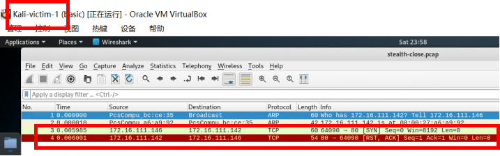    
      
  * 端口开启状态的测试
    * 打开靶机的80端口监听  
    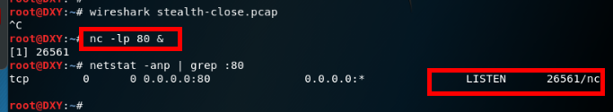
    * 在victim靶机设置监听eth0网卡开始抓包    
      在Attacker攻击者虚拟机运行扫描文件TCP_stealth_scan.py，停止抓包，存储在本地    
      在虚拟机Attacker界面观察到端口扫描的结果是：靶机victim的80端口为打开状态    
      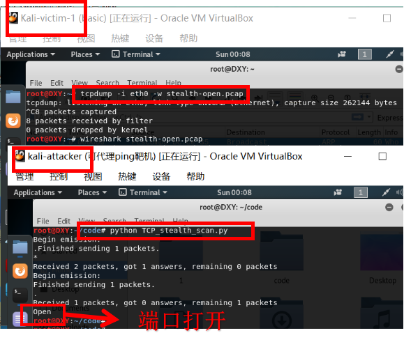    
    * 分析靶机抓到的包      
      * 前三个包类似于TCP连接扫描，完成了SYN, SYN/ACK, 和RST
      * 且最后在TCP数据包中发送的是RST标志而不是RST + ACK。
      * 证明了端口打开，这与课本中的扫描方法原理相符，实验成功。
    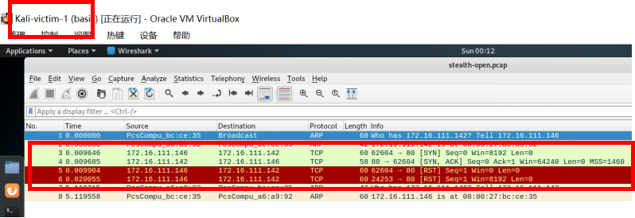    
    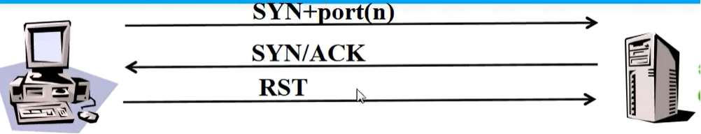 
  * 端口过滤状态的测试
    * 在victim靶机设置80端口被防火墙过滤，确保设置成功  
    
    * 在victim靶机设置监听eth0网卡开始抓包    
      在Attacker攻击者虚拟机运行扫描文件TCP_stealth_scan.py，停止抓包，存储在本地
      在虚拟机Attacker界面观察到端口扫描的结果是：靶机victim的80端口为过滤状态    
    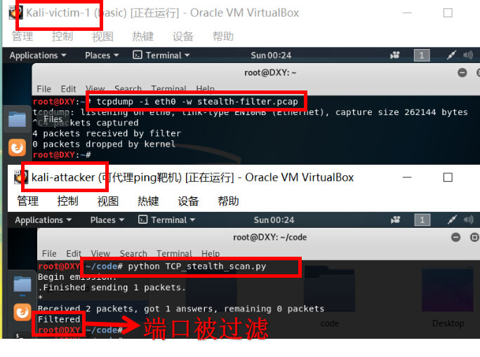    
    * 分析靶机抓到的包      
      * 攻击者主机给靶机的80端口发送了设置SYN标志的TCP包  
      * 靶机没有返回TCP数据包给攻击者主机
      * 靶机返回给攻击者主机一个ICMP数据包，且该包类型为type3
      * 证明了端口被过滤，这与课本中的扫描方法原理相符，实验成功。
    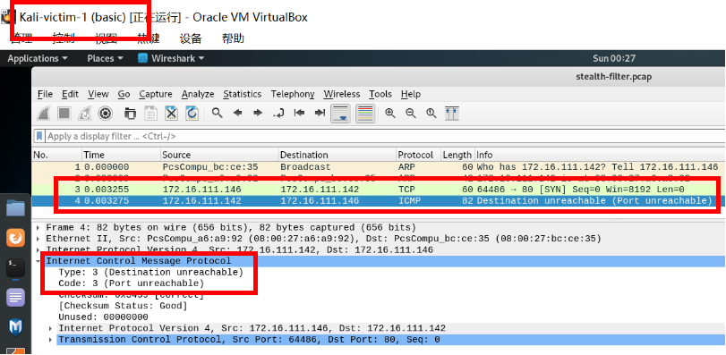    

* TCP XMAS Scan 
  * 端口关闭状态的测试
    * 关闭防火墙  
       
    * 查看靶机哪些端口被打开，发现此时victim靶机的80端口并没有打开监听    
      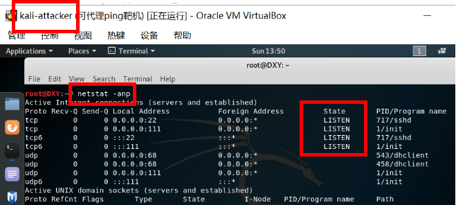      
    * 在victim靶机设置监听eth0网卡开始抓包  
      在Attacker攻击者虚拟机运行扫描文件TCP_xmas_scan.py，停止抓包，存储在本地    
      在虚拟机Attacker界面观察到端口扫描的结果是：靶机victim的80端口为关闭状态    
      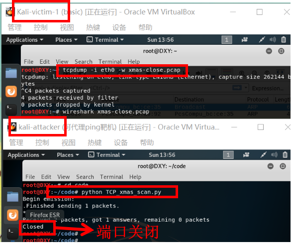    
    * 分析靶机抓到的包      
      * 攻击者主机给靶机的80端口发送了设置了PSH，FIN和URG标志的TCP数据包
      * 靶机发送给攻击者主机的TCP返回包中设置了RST标志
      * 证明了端口关闭，这与课本中的扫描方法原理相符，实验成功。
    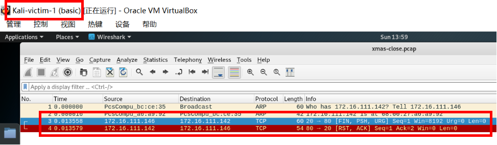    
      
  * 端口开启状态的测试
    * 打开靶机的80端口监听  
    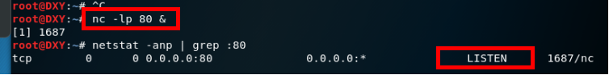
    * 在victim靶机设置监听eth0网卡开始抓包    
      在Attacker攻击者虚拟机运行扫描文件TCP_xmas_scan.py，停止抓包，存储在本地    
      在虚拟机Attacker界面观察到端口扫描的结果是：靶机victim的80端口为打开或被过滤状态    
      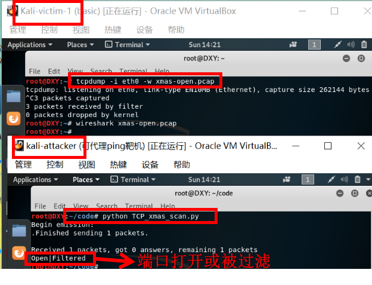    
    * 分析靶机抓到的包      
      * 攻击者主机给靶机的80端口发送了设置了PSH，FIN和URG标志的TCP数据包
      * 靶机没有发送TCP包响应，无法区分其80端口打开/被过滤。
      * 但是靶机也没有发送ICMP数据包给攻击者主机，说明端口不是被过滤状态
      * 由此证明了端口打开，这与课本中的扫描方法原理相符，实验成功。
    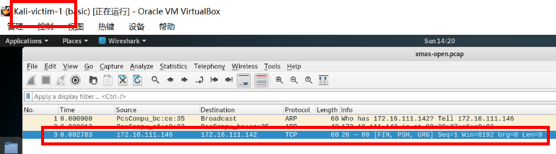    
    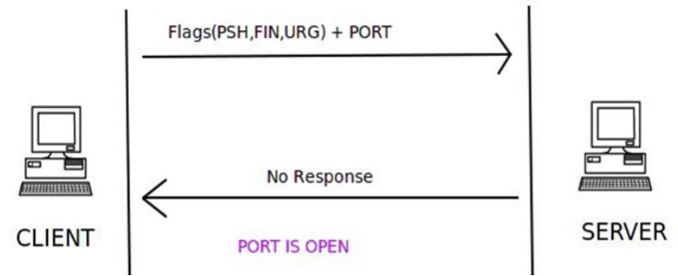 
  * 端口过滤状态的测试
    * 在victim靶机设置80端口被防火墙过滤，确保设置成功  
    
    * 在victim靶机设置监听eth0网卡开始抓包    
      在Attacker攻击者虚拟机运行扫描文件TCP_xmas_scan.py，停止抓包，存储在本地
      在虚拟机Attacker界面观察到端口扫描的结果是：靶机victim的80端口为过滤状态    
    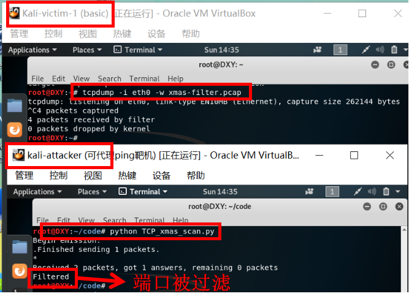    
    * 分析靶机抓到的包      
      * 攻击者主机给靶机的80端口发送了设置了PSH，FIN和URG标志的TCP数据包
      * 靶机返回给靶机一个ICMP数据包，且该包类型为type3
      * 证明了端口被过滤，这与课本中的扫描方法原理相符，实验成功。
    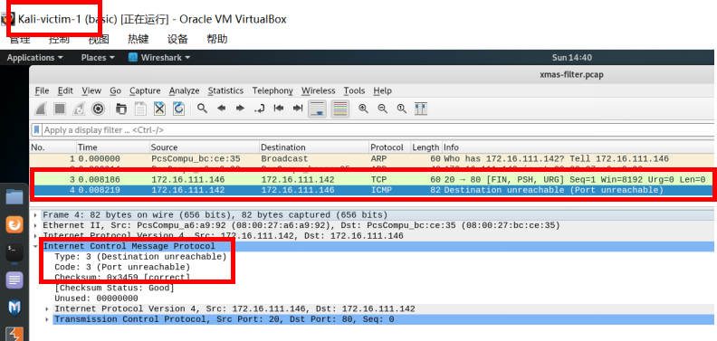    
    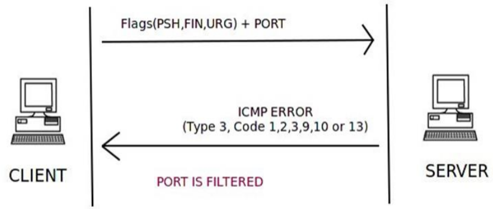 
     
* TCP FIN Scan 
  * 端口关闭状态的测试
    * 关闭防火墙  
       
    * 查看靶机哪些端口被打开，发现此时victim靶机的80端口并没有打开监听    
            
    * 在victim靶机设置监听eth0网卡开始抓包  
      在Attacker攻击者虚拟机运行扫描文件TCP_fin_scan.py，停止抓包，存储在本地    
      在虚拟机Attacker界面观察到端口扫描的结果是：靶机victim的80端口为关闭状态    
      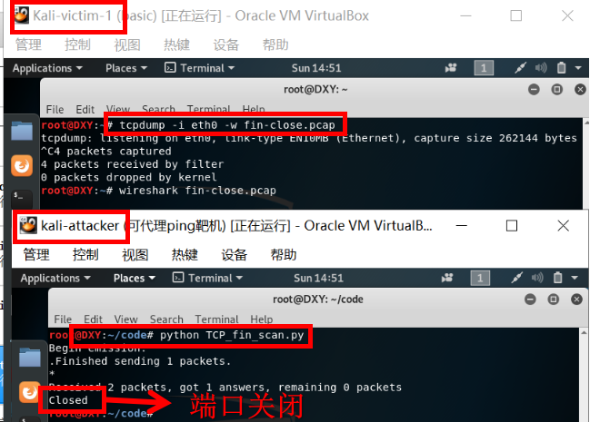    
    * 分析靶机抓到的包      
      * 攻击者主机给靶机的80端口发送了设置了FIN标志的TCP数据包
      * 靶机发送给攻击者主机的TCP返回包中设置了RST标志
      * 证明了端口关闭，这与课本中的扫描方法原理相符，实验成功。
    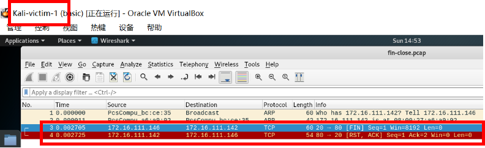    
    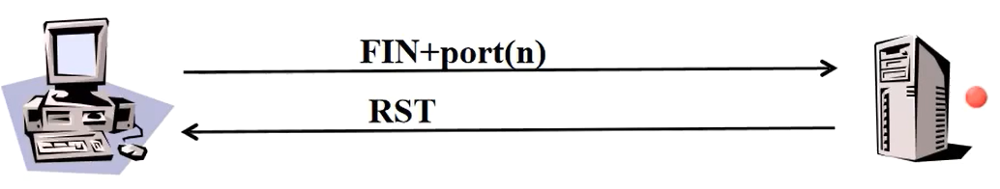  
  * 端口开启状态的测试
    * 打开靶机的80端口监听  
    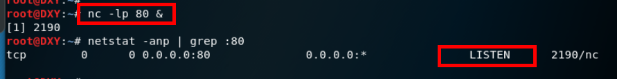
    * 在victim靶机设置监听eth0网卡开始抓包    
      在Attacker攻击者虚拟机运行扫描文件TCP_fin_scan.py，停止抓包，存储在本地    
      在虚拟机Attacker界面观察到端口扫描的结果是：靶机victim的80端口为打开或被过滤状态    
      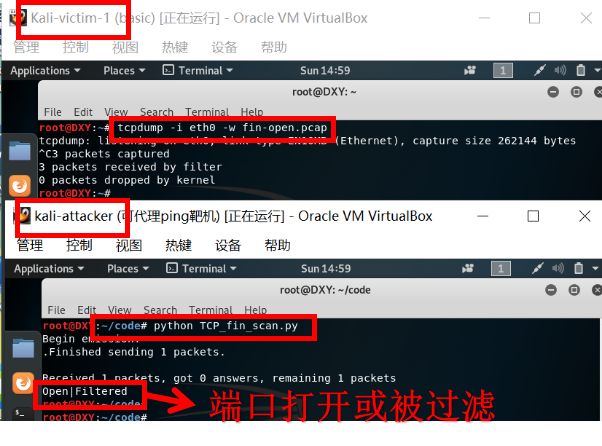    
    * 分析靶机抓到的包      
      * 攻击者主机给靶机的80端口发送了设置了FIN标志的TCP数据包
      * 靶机没有发送TCP包响应，无法区分其80端口打开/被过滤。
      * 但是靶机也没有发送ICMP数据包给攻击者主机，说明端口不是被过滤状态
      * 由此证明了端口打开，这与课本中的扫描方法原理相符，实验成功。
    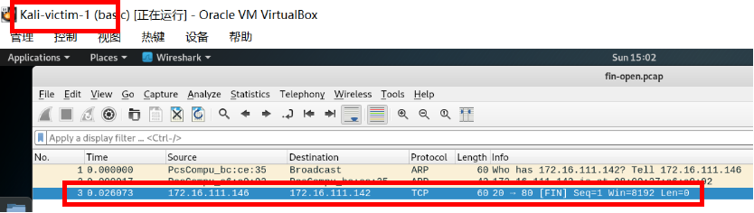    
    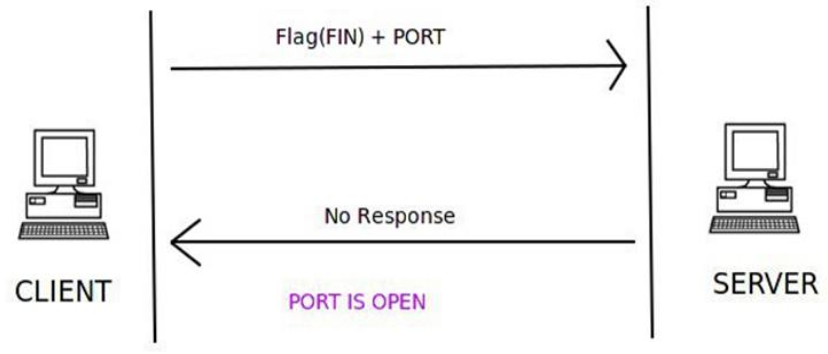 
  * 端口过滤状态的测试
    * 在victim靶机设置80端口被防火墙过滤，确保设置成功  
    
    * 在victim靶机设置监听eth0网卡开始抓包    
      在Attacker攻击者虚拟机运行扫描文件TCP_fin_scan.py，停止抓包，存储在本地
      在虚拟机Attacker界面观察到端口扫描的结果是：靶机victim的80端口为过滤状态    
    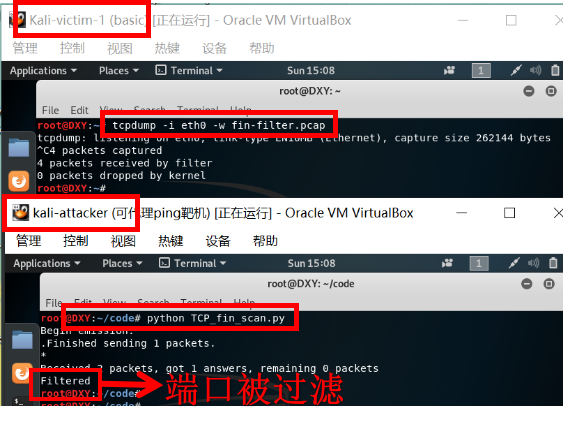    
    * 分析靶机抓到的包      
      * 攻击者主机给靶机的80端口发送了设置了FIN标志的TCP数据包
      * 靶机返回给靶机一个ICMP数据包，且该包类型为type3
      * 证明了端口被过滤，这与课本中的扫描方法原理相符，实验成功。
        
    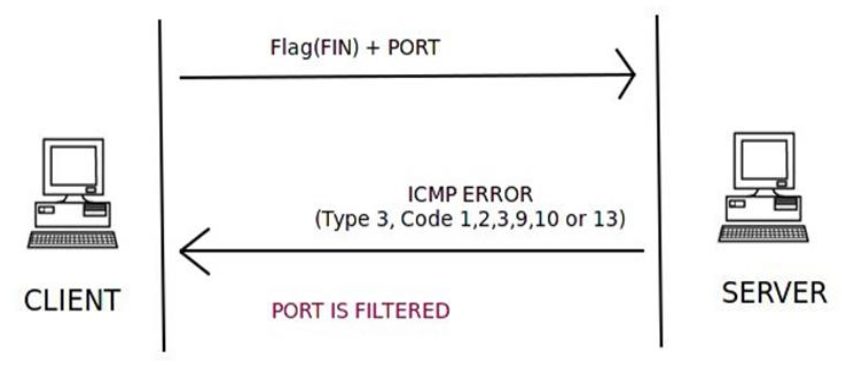 

* TCP NULL Scan 
  * 端口关闭状态的测试
    * 关闭防火墙  
       
    * 查看靶机哪些端口被打开，发现此时victim靶机的80端口并没有打开监听    
            
    * 在victim靶机设置监听eth0网卡开始抓包  
      在Attacker攻击者虚拟机运行扫描文件TCP_null_scan.py，停止抓包，存储在本地    
      在虚拟机Attacker界面观察到端口扫描的结果是：靶机victim的80端口为关闭状态    
      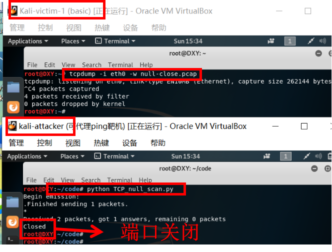    
    * 分析靶机抓到的包      
      * 攻击者主机给靶机的80端口发送了一个没有任何标志位的TCP包
      * 靶机发送给攻击者主机的TCP返回包中设置了RST标志
      * 证明了端口关闭，这与课本中的扫描方法原理相符，实验成功。
    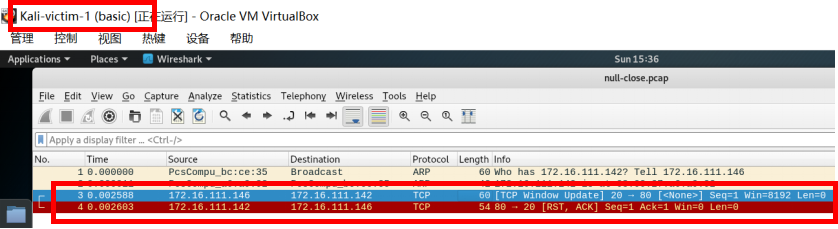    
    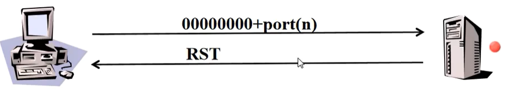  
  * 端口开启状态的测试
    * 打开靶机的80端口监听  
    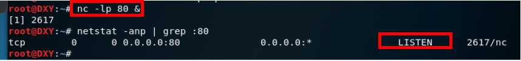
    * 在victim靶机设置监听eth0网卡开始抓包    
      在Attacker攻击者虚拟机运行扫描文件TCP_null_scan.py，停止抓包，存储在本地    
      在虚拟机Attacker界面观察到端口扫描的结果是：靶机victim的80端口为打开或被过滤状态    
      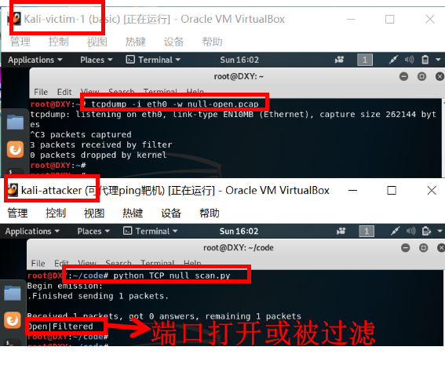    
    * 分析靶机抓到的包      
      * 攻击者主机给靶机的80端口发送了一个没有任何标志位的TCP包
      * 靶机没有发送TCP包响应，无法区分其80端口打开/被过滤。
      * 但是靶机也没有发送ICMP数据包给攻击者主机，说明端口不是被过滤状态
      * 由此证明了端口打开，这与课本中的扫描方法原理相符，实验成功。
    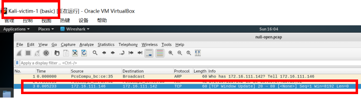    
     
  * 端口过滤状态的测试
    * 在victim靶机设置80端口被防火墙过滤，确保设置成功  
    
    * 在victim靶机设置监听eth0网卡开始抓包    
      在Attacker攻击者虚拟机运行扫描文件TCP_null_scan.py，停止抓包，存储在本地
      在虚拟机Attacker界面观察到端口扫描的结果是：靶机victim的80端口为过滤状态    
    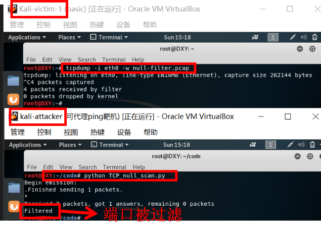    
    * 分析靶机抓到的包      
      * 攻击者主机给靶机的80端口发送了一个没有任何标志位的TCP包
      * 靶机返回给靶机一个ICMP数据包，且该包类型为type3
      * 证明了端口被过滤，这与课本中的扫描方法原理相符，实验成功。
    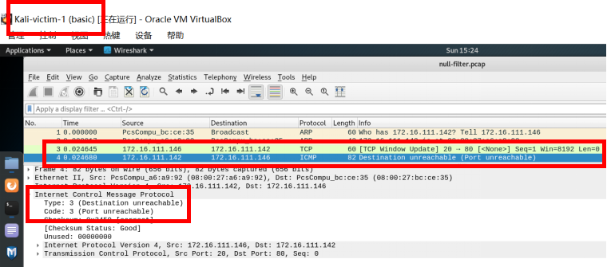    
    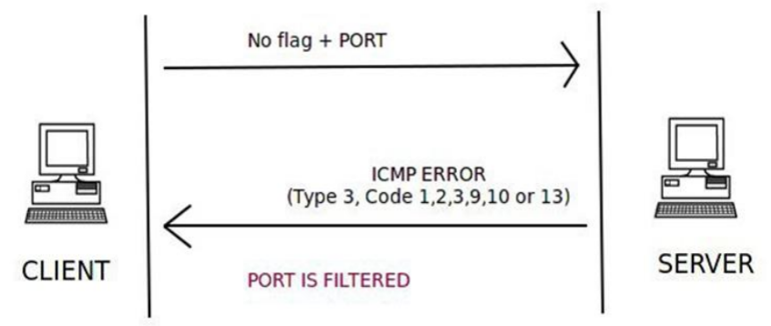 

* UDP Scan 
  * 端口关闭状态的测试
    * 关闭防火墙  
       
    * 查看靶机哪些端口被打开，发现此时victim靶机的80端口并没有打开监听    
            
    * 在victim靶机设置监听eth0网卡开始抓包  
      在Attacker攻击者虚拟机运行扫描文件TCP_udp_scan.py，停止抓包，存储在本地    
      在虚拟机Attacker界面观察到端口扫描的结果是：靶机victim的80端口为关闭状态    
      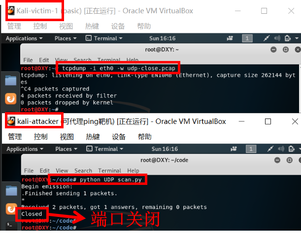    
    * 分析靶机抓到的包      
      * 攻击者主机给靶机的80端口发送了UDP包
      * 靶机响应ICMP端口不可达错误type3和code3
      * 证明了端口关闭，这与课本中的扫描方法原理相符，实验成功。
        
    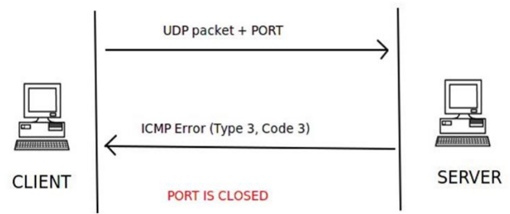  
  * 端口开启状态的测试
    * 打开靶机的80端口监听  
    
    * 在victim靶机设置监听eth0网卡开始抓包    
      在Attacker攻击者虚拟机运行扫描文件TCP_udp_scan.py，停止抓包，存储在本地    
      在虚拟机Attacker界面观察到端口扫描的结果是：靶机victim的80端口为打开或被过滤状态    
      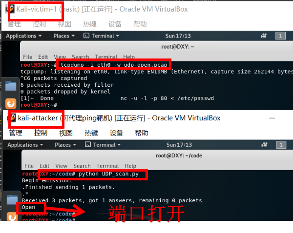    
    * 分析靶机抓到的包      
      * 攻击者主机给靶机的80端口发送了UDP包
      * 靶机响应ipv4包
      * 由此证明了端口打开，这与课本中的扫描方法原理相符，实验成功。
    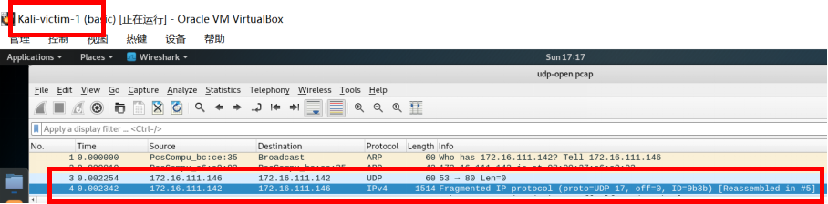    
     
  * 端口过滤状态的测试
    * 结果和端口关闭状态的测试相同
  * UDP扫描测试遇到的问题
    * UDP 扫描实验存在以下缺陷
      * UDP 监听如果想按照目前的扫描逻辑能判断为「开放」状态，可以稍加修改 nc 的启动参数为： nc -u -l -p 80 < /etc/passwd
      * 修改 elif (udp_scan_resp.haslayer(UDP)): 为 elif (udp_scan_resp.haslayer(UDP) or udp_scan_resp.getlayer(IP).proto == IP_PROTOS.udp):
    * 我设置为防火墙过滤80端口后，所有的结果和端口关闭的结果相同，返回的ICMP包都是不可达错误type3和code3，这与网上查阅的资料不符
    * (网上资料显示：如果服务器使用ICMP的type3和code1,2,9,10或13响应客户端，则服务器上的该端口被过滤。)

## （四）复刻 nmap 的上述扫描技术实现的命令行参数开关
* nmap 常用参数
  * -sT： TCP Connect Scan
  * -sS： TCP Stealth Scan
  * -sX： TCP XMAS Scan
  * -sF： TCP FIN Scan
  * -sN： TCP NULL Scan
  * -sU： UDP Scan
  * -p：  port
  * -T<0-5>: Set timing template (higher is faster)
  * -n：  Never do DNS resolution
  * -A：  Enable OS detection, version detection, script scanning, and traceroute
* TCP Connect Scan
  * 端口关闭状态的测试：结果和之前相同          
  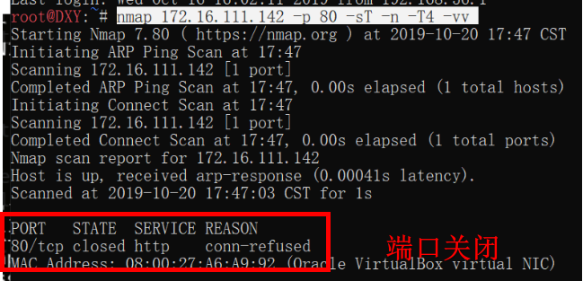    
  * 端口开启状态的测试：结果和之前相同                
  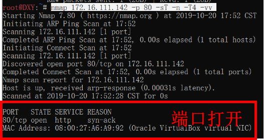      
  * 端口过滤状态的测试：结果和之前不同，这里显示的是“close"而不是"filter",但是抓包结果和之前一样。             
  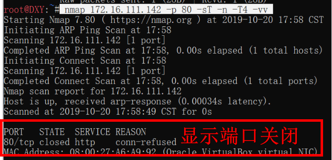    
* TCP Stealth Scan
  * 端口关闭状态的测试：结果和之前相同    
  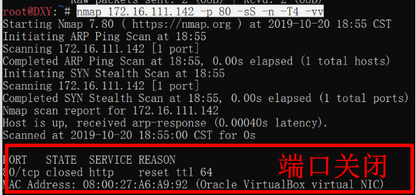    
  * 端口开启状态的测试：结果和之前相同    
  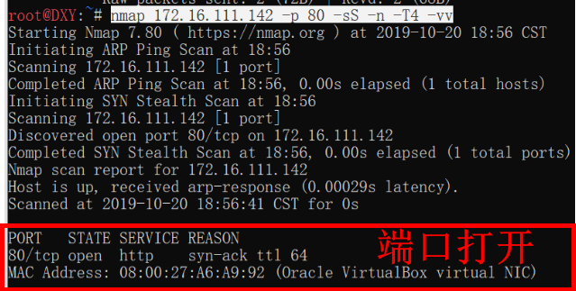      
  * 端口过滤状态的测试：结果和之前相同    
  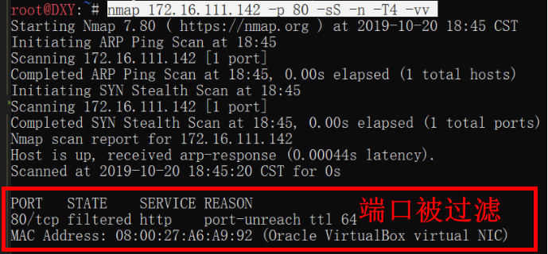  
* TCP XMAS Scan
  * 端口关闭状态的测试：结果和之前相同     
  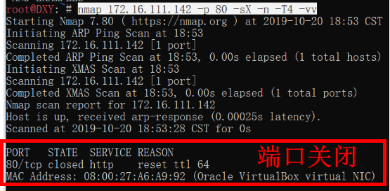    
  * 端口开启状态的测试：结果和之前相同   
  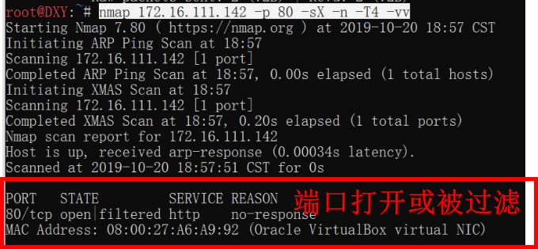      
  * 端口过滤状态的测试：结果和之前相同    
  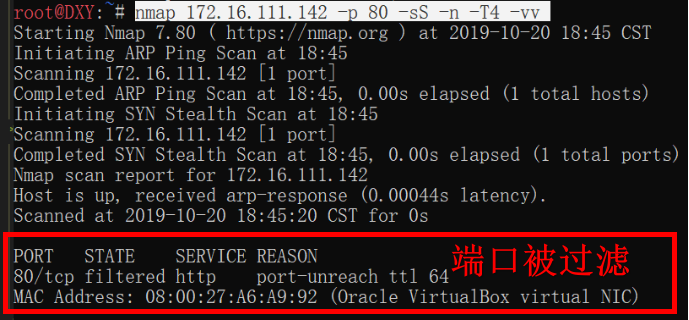  
* TCP FIN Scan
  * 端口关闭状态的测试：结果和之前相同    
  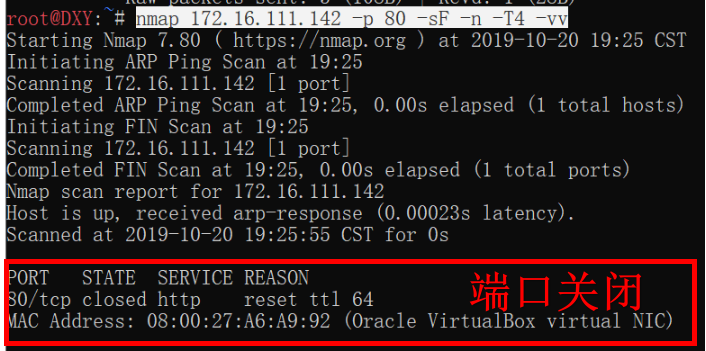    
  * 端口开启状态的测试：结果和之前相同    
  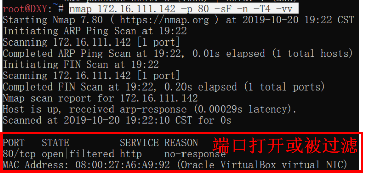      
  * 端口过滤状态的测试：结果和之前相同    
  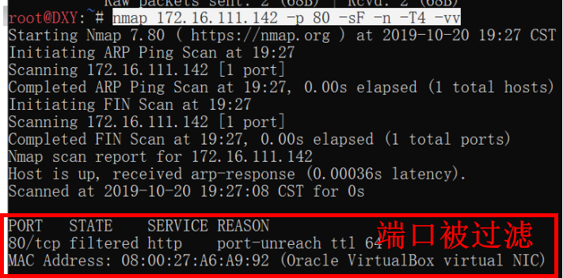  
* TCP NULL Scan
  * 端口关闭状态的测试：结果和之前相同    
  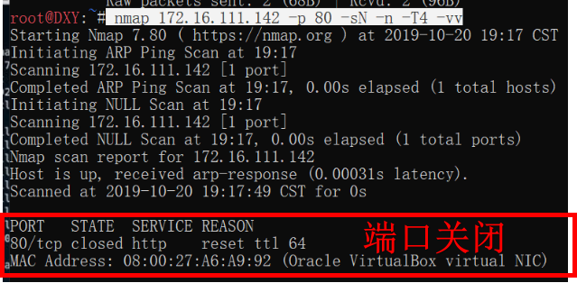    
  * 端口开启状态的测试：结果和之前相同    
  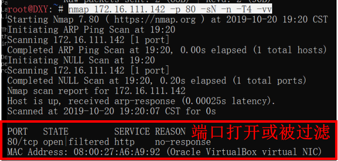      
  * 端口过滤状态的测试：结果和之前相同    
  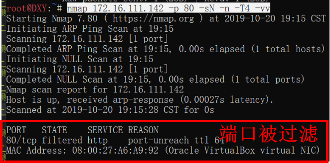  
* UDP Scan
  * 端口关闭状态的测试：结果和之前相同    
  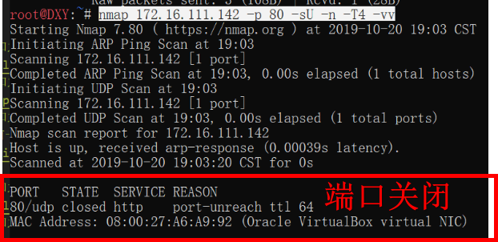    
  * 端口开启状态的测试：结果和之前相同    
  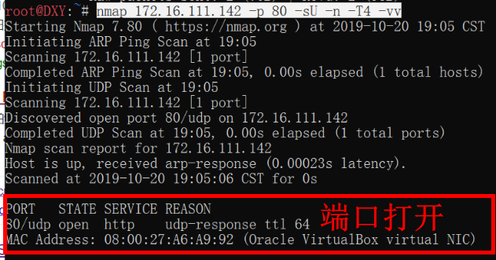      
  * 端口过滤状态的测试：结果和之前相同，都是显示close，不显示filter，抓到的ICMP包都是不可达错误type3和code3    
  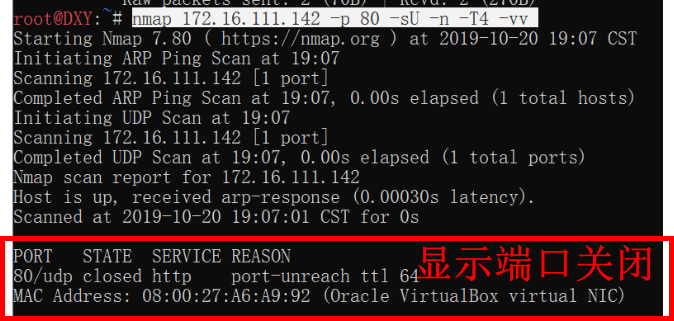  
* 小结：
  * nmap的端口扫描结果和scapy编程结果基本相同    
  * 唯一不同的是 TCP Connect Scan 在端口过滤状态下的扫描：  （但是在靶机抓包结果相同） 
    * scapy 编程的扫描结果：“filtered”
    * nmap 的扫描结果：“closed”  

## 参考资料
* Port Scanning using Scapy https://resources.infosecinstitute.com/port-scanning-using-scapy/
* Linux端口状态查看、启用和关闭 https://www.cnblogs.com/liushuhe1990/p/9728245.html
* nc命令用法举例 https://blog.csdn.net/u012486730/article/details/82019996
* linux防火墙配置（kali） https://www.jianshu.com/p/0cd823302bd7
* 老师给上一届师哥师姐解答的问题 https://github.com/CUCCS/2018-NS-Public-xaZKX/pull/4